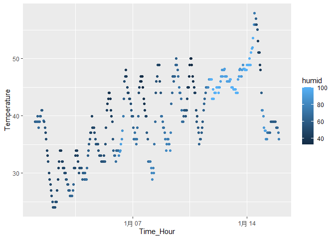

P8105 Homework1
================
Yirou Hu
2025-09-14

``` r
library(moderndive)
library(tidyverse)
```

    ## ── Attaching core tidyverse packages ──────────────────────── tidyverse 2.0.0 ──
    ## ✔ dplyr     1.1.4     ✔ readr     2.1.5
    ## ✔ forcats   1.0.0     ✔ stringr   1.5.1
    ## ✔ ggplot2   3.5.2     ✔ tibble    3.3.0
    ## ✔ lubridate 1.9.4     ✔ tidyr     1.3.1
    ## ✔ purrr     1.1.0     
    ## ── Conflicts ────────────────────────────────────────── tidyverse_conflicts() ──
    ## ✖ dplyr::filter() masks stats::filter()
    ## ✖ dplyr::lag()    masks stats::lag()
    ## ℹ Use the conflicted package (<http://conflicted.r-lib.org/>) to force all conflicts to become errors

# Problem 1

## Load the dataset “early_january_weather”

``` r
data("early_january_weather")
```

## Description of the dataset

This dataset is a weather-related dataset which contains the information
about the hourly 358 observations about the first fifteen days of
January. Given that 15 days have 360 hours, two observations seem to be
missing in this dataset. Additionally, this dataset’s mean temperature
is 40 F. The dataset has 358 rows and 15 columns, and the detailed
information is as follows:

origin: The origin variable, which indicates the source from which the
weather data comes, is of the character type.

year: Year variable represents the year of the data.In this dataset,
they are from the 2013.

month: Month variable denotes the month of the year, which is January in
this dataset.

day: Day variable represents the day of January, it has a range of 1,
15.

hour: Hour variable represents the time within each day, whose range is
0, 23.

temp: This variable represents the temperature with degrees Fahrenheit,
ranging from 24.08 to 57.92.

dewp: This variable is the dew point temperature degrees with degrees in
Fahrenheit, ranging from 8.96 to 53.06.

humid: This variable represents the humidity level, with a range of
32.86 to 100.

wind_dir: This variable represents wind direction. It has missing value
in this dataset. Moreover, it ranges from 0 to 360.

wind_speed: This variable represents the speed of wind with a range of 0
to 24.16638.

wind_gust: This variable has missing value in this dataset. It has a
range from 16.11092 to 31.07106.

precip: This variable has a range from 0 to 0.19 with the meaning of
hourly precipitation.

pressure: Pressure variable measures atmospheric pressure with a range
from 1010.8 to 1034.4. There are missing values in this variable.

visib: This variable indicates visibility in miles degree.

time_hour: This variable indicates the time and date of each
observation.

## Next, we have a scatterplot of temperature regarding time with humidity color.

``` r
ggplot(early_january_weather, aes(x = time_hour, y = temp, color = humid)) + 
  geom_point()+ labs(x = "Time_Hour", y = "Temperature")
```

<!-- -->

``` r
ggsave("p8105_hw1_yh3964_scatterplot.pdf")
```

    ## Saving 7 x 5 in image

    ## Warning in grid.Call.graphics(C_text, as.graphicsAnnot(x$label), x$x, x$y, :
    ## conversion failure on '1月 07' in 'mbcsToSbcs': for 月 (U+6708)

    ## Warning in grid.Call.graphics(C_text, as.graphicsAnnot(x$label), x$x, x$y, :
    ## conversion failure on '1月 14' in 'mbcsToSbcs': for 月 (U+6708)

From the scatterplot of temperature vs time, we can see clear
temperature patterns: Temperatures showed an overall upward trend for
the first half of January. Notably, the fluctuations of the begin,
middle and the end of 15 days are relatively big. From January 11th to
January 14th, humidity levels were increased compared to January 3rd. In
addition, we can observe that ass morning comes and the sun rises,
temperatures go up with a peak around noon, indicating the hottest time
of the day. After that, they slowly drop as the day goes on.

# Problem 2

In this problem, we will create a new dataframe and investigate on the
variables.

## Create a data frame

``` r
df_problem2 = 
  tibble(
    random_sample = rnorm(10),
    logical_vector = random_sample > 0,
    character_vector = c("Apple", "Banana", "Orange", "Mango", "Pear", 
            "Peach", "Grape", "Plum", "Lemon", "Cherry"),
    factor_vector = factor(c("Level 1", "Level 1", "Level 1", "Level 2", "Level 2", "Level 2", "Level 2", "Level 3", "Level 3", "Level 3"))
  )
```

## Calculate the mean of each variable in the dataframe

``` r
mean(pull(df_problem2, random_sample))
```

    ## [1] 0.1240133

``` r
mean(pull(df_problem2, logical_vector))
```

    ## [1] 0.5

``` r
mean(pull(df_problem2, character_vector))
```

    ## Warning in mean.default(pull(df_problem2, character_vector)): argument is not
    ## numeric or logical: returning NA

    ## [1] NA

``` r
mean(pull(df_problem2, factor_vector))
```

    ## Warning in mean.default(pull(df_problem2, factor_vector)): argument is not
    ## numeric or logical: returning NA

    ## [1] NA

As shown in the answer above, the mean can be calculated for
`random_sample` and `logical_vector`, but not for `character_vector` and
`factor_vector`. This is because `random_sample` is a numerical
variable, and `logical_vector` contains 0 and 1 (with 1 representing
TRUE and 0 representing FALSE). Hence, R computes `logical_vector` as
the mean of the combination of 0 and 1. In contrast, `character_vector`
and `factor_vector` return NA when their mean is calculated, as they are
neither logical nor numerical variables. Thus, only the mean of
`random_sample` and `logical_vector` can be computed.

## Convert variables

We use `as.numeric` to convert the type of each variables. We want to
show the code without output by choosing `results="hide"`,
`warning=FALSE`, and `message=FALSE`.

``` r
as.numeric(pull(df_problem2, random_sample))
as.numeric(pull(df_problem2, logical_vector))
as.numeric(pull(df_problem2, character_vector))
as.numeric(pull(df_problem2, factor_vector))
```

By applying `as.numeric` to each variable, we can find that
`logical_vector` is converted successfully with 0 for False and 1 for
True. When I convert a character variable, it shows `NA`. This shows
that we can not convert a character variable. Moreover, we find that the
factor variable `factor_vector` is converted successfully. R converts
the levels of the factor to a numeric representation. In this case,
factor variables take the value of `1` for `Level 1`, `2` for `Level 2`
and `3` for `Level 3`.

Converting variables using `as.numeric` can help explain what happens
when I try to calculate the mean. R only successfully computes the mean
for numeric or logical variables. For character and factor variables,
`mean()` fails to give an answer unless the user explicitly converts
them with a clear numeric interpretation. Transforming these variables
into numeric form allows them to be used in calculations, but it is
important to confirm that the resulting values have a meaningful
interpretation for computing the mean.
